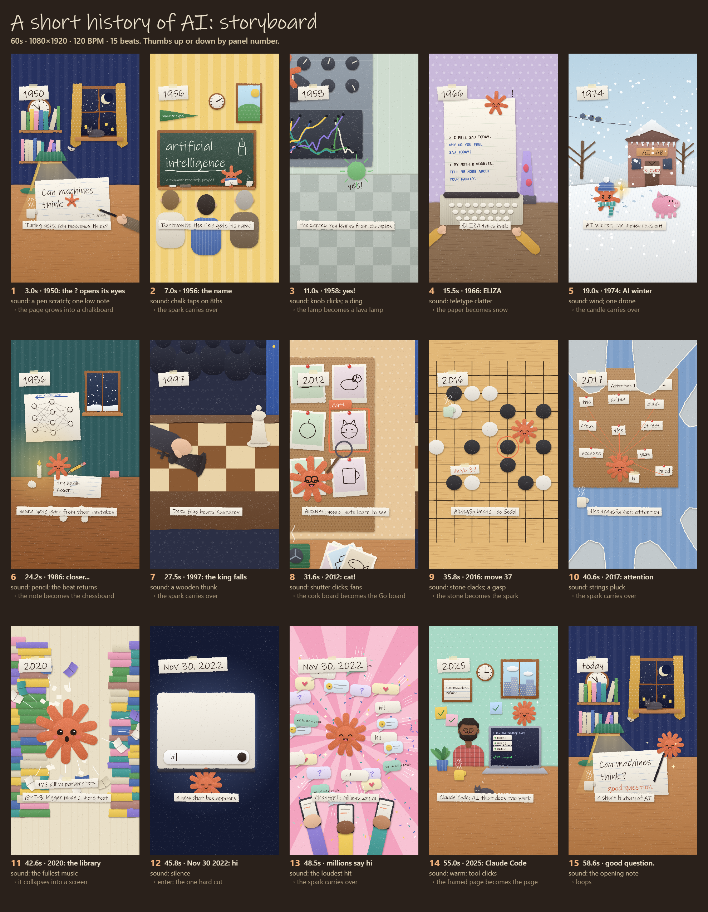

# Animate — hand-drawn procedural animation for Claude Code

A Claude Code skill that makes short animated videos entirely in code: one `<canvas>`, drawn and scored procedurally, deterministic frame by frame, rendered to MP4 with a headless browser and ffmpeg. Explainers, histories, little stories — in a hand-made look (cut paper, crosshatch ink).



*The storyboard of the worked example, "A short history of AI" (60s, 9:16): every panel is a frame of the finished video.*

## How it works

The skill walks you through a few questions, then makes you approve three cheap things before it spends time animating:

| step | what you see | you decide |
|---|---|---|
| 0. Intake | a handful of questions (subject, length, voice, references, hero) | answers, or "just make it" |
| 1. Story check | the format it picked and a numbered beat table, facts web-checked | approve / change beats |
| 2. Look check | 2–4 full-size style frames | thumbs up per frame |
| 3. Storyboard | every beat as a key frame, with sound and the transition into the next | thumbs up/down by panel number |
| 4. Build | — (animate the approved panels, render, review) | — |
| 5. Delivery | the video plus measured checks: cuts on the beat grid, story arc loudness, hero anchoring, the loudest moment after the silence | notes → a revision run |

What's baked in:

- **A story grammar** (`grammar/`) — 8 short-form formats (a history is a chronology joined by shape morphs; a mission cuts on the beat; …), the rules every piece follows (one constant, colour means one thing, silence before the payoff and loudest on it, the end is the start changed), and a checklist for what a single frame needs (a character with a face, a full-bleed world, visible medium, background life).
- **A kit** (`kit/`) — seeded randomness and a hand-drawn line that boils on 2s; a cut-paper kit (torn edges, shadows, crayon, patterns, faces, a hero character); cameras; a shape-morph transition (the old world closes in on one object, it morphs into the next world's counterpart, the new world opens out of it); a synthesizer and a loudness stage for phone playback.
- **Tools** (`tools/`) — build (assembles one self-contained `index.html`), test tiles, storyboard, export (frames → WAV + stems → MP4), and review (contact sheets and the measured checks).
- **Craft rules** (`craft.md`) — everything learned building these pieces, from "the sustained pad sets a section's loudness, not the plucks" to "cameras put a world point on a screen point".

## Install

Requirements: [Claude Code](https://code.claude.com), Node 18+, [Playwright](https://playwright.dev) with Chromium, and ffmpeg on your PATH.

```bash
npm i -g playwright && npx playwright install chromium
```

As a plugin:

```
/plugin marketplace add cth9191/animate
/plugin install animate@animate
```

Or copy the skill folder by hand: `plugins/animate/skills/animate/` → `~/.claude/skills/animate/`.

## Use

```
/animate a 45-second history of the bicycle
```

Pieces are created in your project under `pieces/<name>/`. You can also drive the tools yourself:

```bash
SKILL=~/.claude/skills/animate            # or the plugin's install path
node $SKILL/tools/build.mjs pieces/my-piece
PIECE=pieces/my-piece node $SKILL/tools/tile.mjs tile.png 24 48 96
node $SKILL/tools/storyboard.mjs pieces/my-piece/index.html pieces/my-piece/storyboard.png
node $SKILL/tools/export.mjs pieces/my-piece --share
node $SKILL/tools/review.mjs pieces/my-piece
```

Open any built `index.html` in a browser to preview it (click to hear the score; `?t=12.5` freezes a frame).

## The example

`plugins/animate/skills/animate/examples/history-of-ai/` is a complete 60-second piece built with the kit: 15 eras from Turing's "Can machines think?" (1950) to Claude Code (2025), a small orange "spark" that gains a ray each era, 13 shape-morph transitions, one hard cut on the payoff, and a synthesized score. Build it with `node plugins/animate/skills/animate/tools/build.mjs plugins/animate/skills/animate/examples/history-of-ai`, then export it.

## Credits

The story grammar was learned by studying the short-form animations Kevin Ngo posts publicly; this project is not affiliated with him and contains none of his media. Everything here — the kit, the tools, the example — is original code.

## License

MIT
