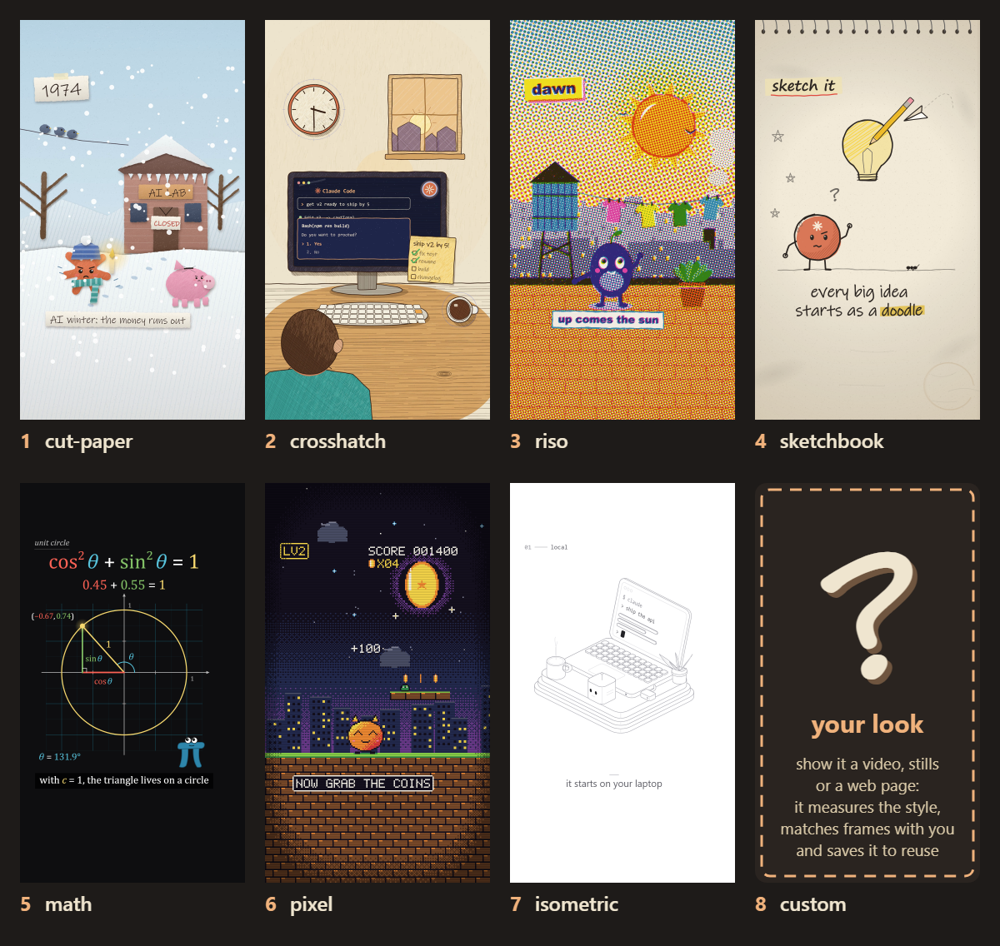

# Animate — procedural animation in any style, for Claude Code

A Claude Code skill that makes short animated videos entirely in code: one `<canvas>`, drawn and scored procedurally, deterministic frame by frame, rendered to MP4 with a headless browser and ffmpeg. Explainers, histories, little stories — in one of the built-in styles, or in a new look matched from your own references.



*The built-in styles, each a frame from its demo piece: cut paper, crosshatch ink, riso print, sketchbook, math, pixel, isometric — and the eighth slot: any other look, made from your references.*

## How it works

The skill walks you through a few questions, then makes you approve three cheap things before it spends time animating:

| step | what you see | you decide |
|---|---|---|
| 0. Intake | a handful of questions (subject, formats, voice, the look, hero, your music, your product) and the style gallery | answers, a style, or your references |
| 1. Story check | the format it picked and a numbered beat table, facts web-checked | approve / change beats |
| 2. Look check | 2–4 full-size style frames (for a new look: side-by-side comparisons with your references) | thumbs up per frame |
| 3. Storyboard | every beat as a key frame, with sound and the transition into the next | thumbs up/down by panel number |
| 4. Build | — (animate the approved panels, render, review) | — |
| 5. Delivery | the video plus measured checks: cuts on the beat grid, story arc loudness, hero anchoring, the loudest moment after the silence, narration pace | notes → a revision run |

## Styles

A style is a plug-in: the story grammar, timing, sound, renderer and tools stay the same; the style supplies the drawing kit. A piece picks one in its `piece.json` (`"style": "riso"`).

| style | the look |
|---|---|
| cut paper | torn paper, drop shadows, crayon, patterns, characters with faces |
| crosshatch | sketchy ink that boils on 2s, hatch and pencil shading, warm paper and navy "inside the machine" worlds |
| riso | a three-ink risograph print: halftone screens at their own angles, overprints, misregistration |
| sketchbook | graphite and one accent colour on a sketchbook page, hand lettering |
| math | a manim-style math explainer: black stage, axes and graphs, colour-coded variables, smooth easing |
| pixel | low-resolution eras: drawn at the true resolution, upscaled nearest-neighbour, a bitmap font |
| isometric | precise isometric line art: constant hairlines, white faces hiding what's behind, rounded slabs, one dark accent; light or dark ground |

**Your own look:** give the skill references (a video, stills, a web page) and it follows a procedure — measure the palette, line weight, texture, motion and cut rhythm; draw 1–2 matched frames next to your references (`tools/compare.mjs`); ask for your thumbs up; save it as `styles/<name>/` in your project so every later piece can use it. Reference media stays on your machine.

Each style folder has a `STYLE.md` (its rules, palette, motion habits and a frame checklist), a `kit.js`, a `sample.png` and a small `demo/` piece.

## What's baked in

- **A story grammar** (`grammar/`) — 8 short-form formats (a history is a chronology joined by shape morphs; a mission cuts on the beat; …), the rules every piece follows (one constant, colour means one thing, silence before the payoff and loudest on it, the end is the start changed), and a checklist for what any single frame needs.
- **A kit** (`kit/`) — seeded randomness and a line that boils on 2s; cameras; a renderer with shape-morph transitions (the old world closes in on one object, it morphs into the next world's counterpart, the new world opens out of it) that draws through the style's hooks; a storyboard; a synthesizer and a loudness stage for phone playback.
- **Tools** (`tools/`) — build (assembles one self-contained `index.html` from the piece, the kit and the style), test tiles, stills, storyboard, export (frames → WAV + stems → MP4), review (contact sheets and the measured checks, including text that's cut off or overlapping, and loudness), compare (reference vs frame), a reference measurer, gallery, and a frame-hash check that a kit change left a piece pixel-identical.
- **Craft rules** (`craft.md`) — everything learned building these pieces, from "the sustained pad sets a section's loudness, not the plucks" to "cameras put a world point on a screen point".
- **A voice-over** — it writes the script, gets one take per line from the ElevenLabs connector (or your recording), hears when every word is spoken (locally, with faster-whisper) and times the picture to the words; re-takes re-time the picture automatically.
- **Your own music** — give it a track and it maps the beats (tempo, bars, the big hits, the drops), cuts on the song's beats and puts the payoff on its loudest hit; or it composes a score in code.
- **Your real product** — it screenshots your site (or takes your logo files) and animates the real screens inside the style.
- **Every format from one piece** — 9:16, 1:1, 4:5 and 16:9 laid out for each shape, not cropped.
- **Motion that feels expensive** — closed-form springs in the kit and optional motion blur for smooth styles.
- **Parallel builds** — long pieces split one scene file per agent, joined by the build.

**Coming:** a WebGL motion-design style (ray-marched 3D, sub-frame motion blur, bloom) — the export and review tools already run WebGL pieces on the GPU and warn when only software rendering is available.

## Install

Requirements: [Claude Code](https://code.claude.com), Node 18+, [Playwright](https://playwright.dev) with Chromium, and ffmpeg on your PATH. Fonts are local system fonts with fallbacks for Windows, macOS and Linux. For voice-overs: Python with `faster-whisper` (word timing) and, optionally, the ElevenLabs connector in Claude (Settings → Connectors) for the voice.

```bash
npm i -g playwright && npx playwright install chromium
```

As a plugin:

```
/plugin marketplace add cth9191/animate
/plugin install animate@animate
```

Or copy the skill folder by hand: `plugins/animate/skills/animate/` → `~/.claude/skills/animate/`.

## Use

```
/animate a 45-second history of the bicycle, cut paper
/animate how a hash map works, in the math style
/animate a short about our API in the style of these screenshots: ./refs/
/animate a 20s launch reel for https://my-product.com, cut to ./audio/song.mp3, vertical and square
/animate a narrated 45s explainer of how DNS works, math style, 16:9, voice from ElevenLabs
```

Pieces are created in your project under `pieces/<name>/`. You can also drive the tools yourself:

```bash
SKILL=~/.claude/skills/animate            # or the plugin's install path
node $SKILL/tools/build.mjs pieces/my-piece
node $SKILL/tools/tile.mjs pieces/my-piece tile.png 24 48 96
node $SKILL/tools/still.mjs pieces/my-piece 2.5,9,14 frames.png --scale 0.5
node $SKILL/tools/storyboard.mjs pieces/my-piece
node $SKILL/tools/beats.mjs pieces/my-piece/audio/track.wav pieces/my-piece --start 12
node $SKILL/tools/capture.mjs https://my-product.com pieces/my-piece/assets/home.png
node $SKILL/tools/voice.mjs pieces/my-piece            # voice/script.json + one take per line -> voice.wav, voice.json (--scratch: a timing voice)
node $SKILL/tools/export.mjs pieces/my-piece --share --formats 9:16,1:1,16:9
node $SKILL/tools/review.mjs pieces/my-piece
node $SKILL/tools/measure/refs.mjs references/my-look/
node $SKILL/tools/compare.mjs references/my-look/a.png pieces/my-piece 2.5 compare.png --auto-trim
```

Open any built `index.html` in a browser to preview it (click to hear the score; `?t=12.5` freezes a frame). Every style's demo builds the same way: `node $SKILL/tools/build.mjs $SKILL/styles/riso/demo`.

## The example

`plugins/animate/skills/animate/examples/history-of-ai/` is a complete 60-second cut-paper piece: 15 eras from Turing's "Can machines think?" (1950) to Claude Code (2025), a small orange "spark" that gains a ray each era, 13 shape-morph transitions, one hard cut on the payoff, and a synthesized score. Build it with `node plugins/animate/skills/animate/tools/build.mjs plugins/animate/skills/animate/examples/history-of-ai`, then export it.

## License

MIT
